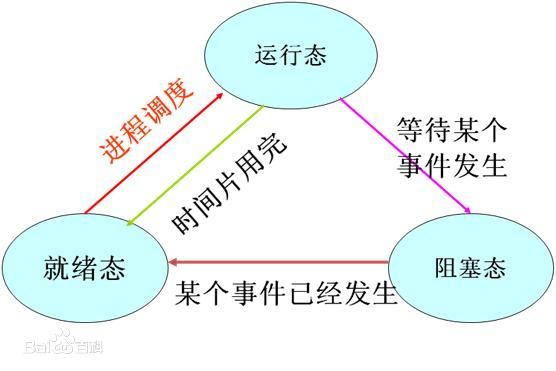

# 线程基础
多线程（multithreading），是指从软件或者硬件上实现多个线程并发执行的技术。
每次初始化进程时，系统都会创建一个主线程。

# 线程组成部分：
* 内核对象：操作系统用它来管理线程、存放线程统计信息
* 线程栈：用于维护线程执行时所需的所有函数参数和局部变量

# 为什么要使用多线程
如前面所述，进程初始化时，系统会创建一个主线程。如果进程需要执行多个任务，如发送、打印等。  
如果只有一个线程，这些任务都需要按顺序执行，即前面的执行完后面的才能执行。  
假设某个任务持续的时间较长，界面无法实时更新，应用程序就好像失去响应一样。  
这个时候就需要使用多线程。多个任务由不同的线程去执行，不同线程各自占用CPU一段时间，即使线程任务还没完成，也会让出CPU时间给其它线程有机会去执行。  
这样，在用户角度看来，用户界面就永远保持更新，其它任务也在同步运行，提升了软件的友好程度。

# 多核心CPU
如果我计算机有两个CPU，而且应用程序有两个线程，那么两个CPU都会很忙。而结果就是：只需花一个任务的时间，两个任务都可以完成。
如果计算机只有一个CPU，而且应用程序有两个线程，那么两个CPU都会很忙。而结果就是：两个任务在各自的时间片内去执行。
关于线程的时间片会配，后面会说明。

# 进程和线程
进程（Process）是计算机中的程序关于某数据集合上的一次运行活动，是系统进行资源分配和调度的基本单位。  
进程就是正在运行的程序  
Windows能同时运行多个进程，如运行网易云音乐的同时，又能运行QQ。  

进程有三种状态
* 运行态：正在CPU中运行
* 就绪态：运行准备就绪，但其它进程正在运行，所以只能等待（等待分配时间片）
* 阻塞态：由于进程等待某种条件（如I/O操作或进程同步），在条件满足之前无法继续执行。该事件发生前即使把处理器资源分配给该进程，也无法运行。
  

每个进程中至少有一个线程（主线程）。线程是程序执行的最小执行单位，是操作系统分配CPU时间的最小实体。  
线程是属于进程的，线程运行在进程空间内，同一进程所产生的线程共享同一内存空间，当进程退出时该进程所产生的线程都会被强制退出并清除。  
*注意：在某些情况下，可能由于线程未正常退出，而导致程序未完全退出，最常见的就是窗体已经关闭了，而进程在任务管理器还可以看到*

# 使用多线程的情况 
* 程序中各任务相对独立，如更新界面状态信息、提供服务功能等
* 某些任务耗时较多，如下载操作，打印操作
* ...  

# 线程调度
进程中有了多个线程后，就要管理这些线程如何去占用CPU，这就是线程调度。线程调度通常由操作系统来安装，不同的操作系统其调度方法不同。  
Windows操作系统是一个优先级驱动、抢占式操作系统，也就是线程具有优先级。具有高优先级的可运行的线程总是先运行。
由于这种抢占式的调度，一个正在运行的线程可能在未完成其时间片时，被更高优先级的线程所抢占，甚至一个线程会在未开始其时间片前就被抢占了，而要等待下一次被选择运行。  

调度线程是在内核中进行的。当发生下面这些事件时，将触发内核进行线程调度：
* 线程的状态变成就绪状态。例如：一个新创建的线程，或者从等待状态释放出来的线程。
* 线程的时间片结束而离开运行状态，它可能运行结束了，或者进入等待状态
* 线程的优先级改变了
* 出现了其它更高优先级的线程

